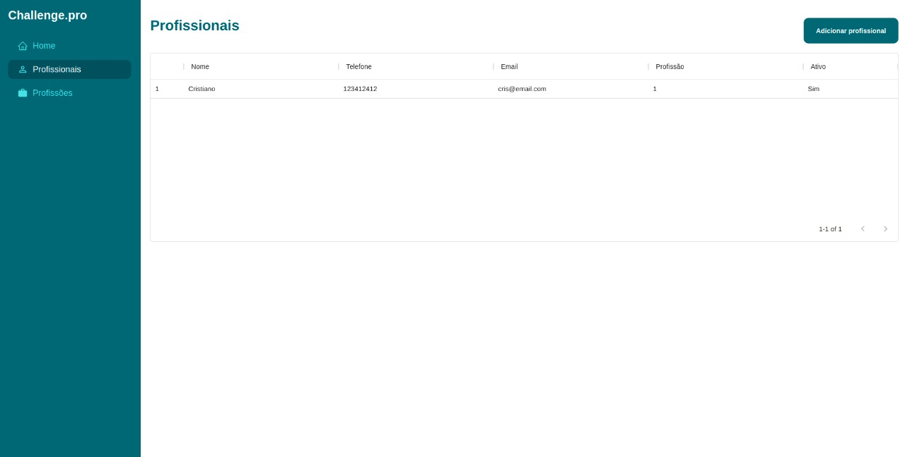
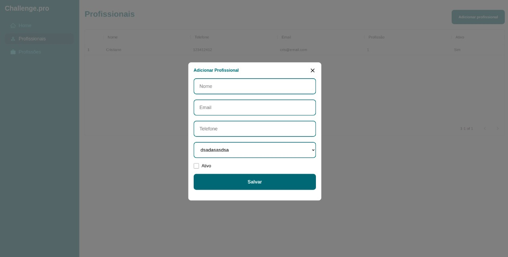
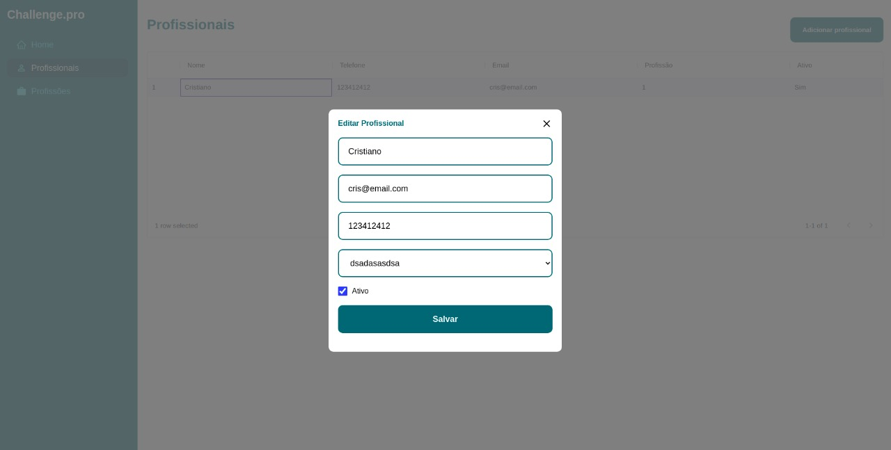
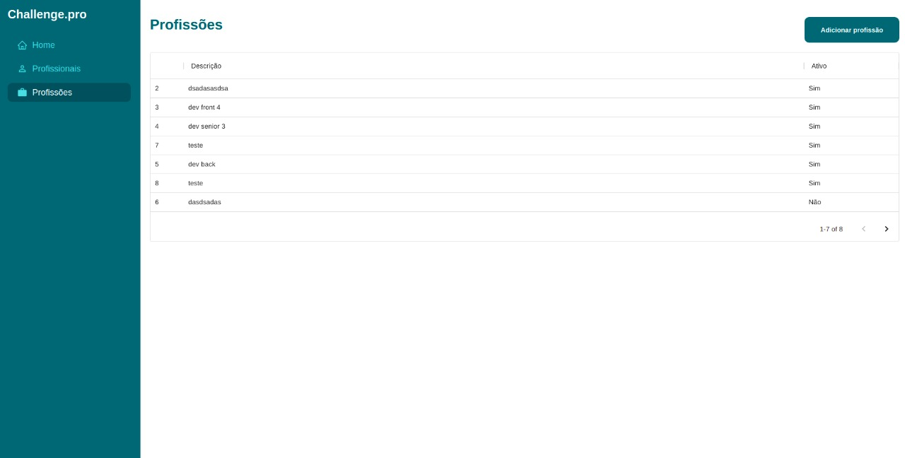
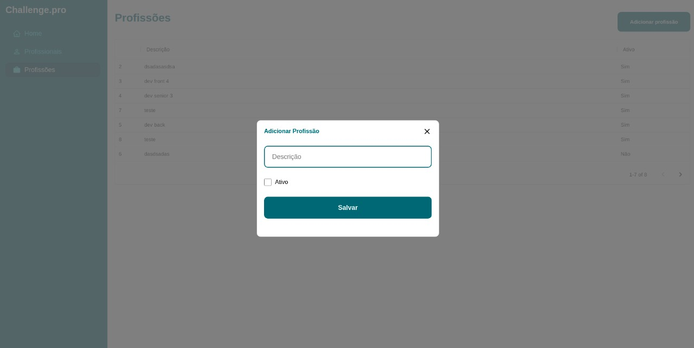

# Documentação front-end

### Estrutura das pastas

```
| - src
| -- _layouts
| -- apis
| --- Entidade
| -- assets
| -- components
| -- hooks
| --- Entidade
| -- pages
| -- routes
| -- services
| -- styles
| -- util
| -- app.js
| -- index.js
```

Descrição:

- /\_layouts: contém o layout (design) que é utilizado na plataforma.
- /apis: contém os códigos de acesso a API utilizando o axios.
- /assets: contém as imagens do projeto;
- /hooks: contém os códigos responsáveis pela manipulação da lógica da aplicação, ele faz a manipulação das chamadas a API, além de facilitar a escalabidade do projeto.
- /pages: contém os componentes que são renderizados do projeto.
- /components: contém os componentes que são utilizados nas pages, como exemplo a SideBar.
- /util: contém algumas utilidades como as Schemas de validação.

A escolha desse padrão foi feita com objetivo de facilitar a escalabidade do projeto e com base em outros projetos feitos e no meu atual trabalho.

## Decisões do Projeto

- Axios: Fui apresentado ao axios quando começei a estudar frontEnd com ReactJs, desde então é que eu tenho mais experiência e além de ser bastante completo e fácil de configurar.

- Yup: Por ser facilmente reutilizado, utilizei as schemas feitas no backend para o frontend.

- Material-UI: Pela a facilidade de criação de tabelas, modais e como teria pouco tempo para desenvolver o projeto, decidi utilizar algo mais prático e bastante conhecido como é essa framework.

- Formik: Utilizar o formik foi uma decisão baseada no conhecimento que a MaxxiData utiliza ele em suas decisões, para conhecer um pouco mais, resolvi utilizar ele para extrair o conhecimento da utilização na prática e reconheci que é de fácil utilização.

- Styled-components: A forma de estilizar que tenho mais conhecimento depois do CSS e com ele é fácil manipular a estilização de componentes como o do Material-UI.

## Telas da aplicação

Tela do profissionais


Modal de criação


Modal de edição


Tela das profissões


Modal de criação


## Rodar localmente

### Requisitos

- Rodar localmente o backend

Clone o projeto

```bash
  git clone https://github.com/Cristianojr9/fullstack-challenge/tree/master/frontend
```

Inicie o backend

```bash
    Inicie o backend localmente
```

Instale as dependências

```bash
  yarn
```

Inicie o servidor

```bash
  yarn start
```
